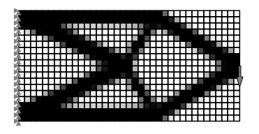

[](https://opensource.org/licenses/MIT)


[](https://mybinder.org/v2/gh/meyer-nils/structural_optimization_exercise/HEAD)
[](https://github.com/meyer-nils/structural_optimization/actions/workflows/main.yml)

# Structural Optimization
This is accompanying code for my *Structural Optimization* lecture MRM-0156. 

- [Latest manuscript as HTML](https://meyer-nils.github.io/structural_optimization/)
- [Latest manuscript as PDF](https://github.com/meyer-nils/structural_optimization/releases/download/v1.0.0/structural_optimization.pdf)

## Structure of the repository
The repository is organized as follows: 

- **chapters** contains the LaTeX source files of the manuscript chapters. The manuscript is build automatically for each commit with a GitHub action.
- **figures** contains all the figures used in the manuscript. The majority of them is created via Jupyter notebooks, so you may reproduce them yourself. See manuscript for references of figures adapted from other sources. 
- **notebooks** contains all the notebooks with accompanying code and a simple truss and FEM solver for the lecture. The images of the lecture are generated with notebooks having a prefix `lecture`, the solution to exercises are documented in notebooks having a prefix `exercise`, and the unsolved exercises have a suffix `_unsolved`. 

## Installation
You may start the notebooks directly in your browser using [Binder](https://mybinder.org/v2/gh/meyer-nils/structural_optimization_exercise/HEAD) or [Google Colab](https://colab.research.google.com/). 

Alternatively, it is recommended to use conda in conjunction with VS Code. For installation it is best to create a new conda environement via
```
    conda create -n pytorch python=3.10
```
and activate the environment via
```
    conda activate pytorch
``` 

The necessary packages are then installed via
```
    conda install matplotlib meshio jupyter notebook
    conda install pytorch torchvision torchaudio cpuonly -c pytorch
```

## Examples

### Unconstrained optimization basics
<p align="center">
  
</p>

### Constrained optimization basics
<p align="center">
  
</p>

### Size optimization of trusses
<p align="center">
  
</p>

### Shape optimization of trusses
<p align="center">
  
</p>

### Topology optimization of a cantilever beam
<p align="center">
  
</p>

