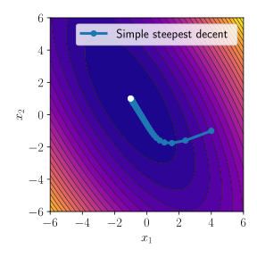
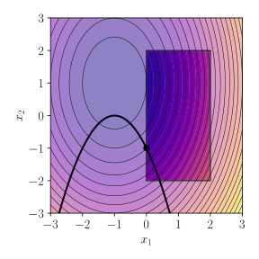
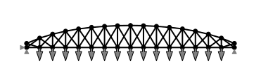

# Structural Optimization
This is accompanying code for my *Structural Optimization* lecture MRM-0156. 

## 1 Introduction

- [Theory](https://meyer-nils.github.io/structural_optimization/introduction.html)

## 2 Unconstrained optimization

- [Theory](https://meyer-nils.github.io/structural_optimization/unconstrained_optimization.html)
- [Code](https://meyer-nils.github.io/structural_optimization/lecture_02_unconstrained_optimization.html)
- [Exercise](https://meyer-nils.github.io/structural_optimization/exercise_02_unconstrained_optimization_unsolved.html)
- [Solution](https://meyer-nils.github.io/structural_optimization/exercise_02_unconstrained_optimization.html)

  

## 3 Constrained optimization

- [Theory](https://meyer-nils.github.io/structural_optimization/constrained_optimization.html)
- [Code](https://meyer-nils.github.io/structural_optimization/lecture_03_constrained_optimization.html)
- [Exercise](https://meyer-nils.github.io/structural_optimization/exercise_03_constrained_optimization_unsolved.html)
- [Solution](https://meyer-nils.github.io/structural_optimization/exercise_03_constrained_optimization.html)

  

## 4 Optimization using local approximations

- [Theory](https://meyer-nils.github.io/structural_optimization/approximation_optimization.html)
- [Code](https://meyer-nils.github.io/structural_optimization/lecture_04_approximation.html)
- [Exercise](https://meyer-nils.github.io/structural_optimization/exercise_04_approximation_unsolved.html)
- [Solution](https://meyer-nils.github.io/structural_optimization/exercise_04_approximation.html)

## 5 Trusses in a nutshell

- [Theory](https://meyer-nils.github.io/structural_optimization/truss.html)
- [Code](https://meyer-nils.github.io/structural_optimization/lecture_05_truss.html)
- [Exercise](https://meyer-nils.github.io/structural_optimization/exercise_05_sizing_unsolved.html)
- [Solution](https://meyer-nils.github.io/structural_optimization/exercise_05_sizing.html)

## 6 Optimization of truss structures

- [Theory](https://meyer-nils.github.io/structural_optimization/truss_optimization.html)

  

## 7 Finite element analysis in a nutshell

- [Theory](https://meyer-nils.github.io/structural_optimization/fem.html)

## 8 Optimization of continuum structures

- [Theory](https://meyer-nils.github.io/structural_optimization/fem_optimization.html)

